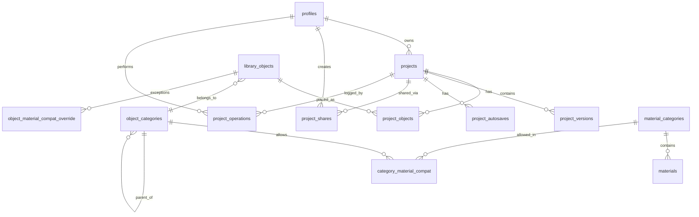

# PostgreSQL Architecture Plan — 3D Interior Design Editor

---

## Table of Contents

1. High-Level Architecture
2. PostgreSQL Schema (full DDL)
3. Table Relationships
4. JSON vs Relational Decisions
5. Index Recommendations
6. Material / Object Compatibility Strategy
7. Scene Serialization Strategy
8. Scalability Considerations
9. Future-Proofing
10. Supabase RLS Policies
11. Express Backend Folder Structure

---

## 1. High-Level Architecture

```
┌─────────────────────────────────────────────────────────────┐
│                        Browser                              │
│  React Three Fiber / Three.js  ◄──── REST + WS ────────    │
└────────────────────────┬────────────────────────────────────┘
                         │ HTTPS
┌────────────────────────▼────────────────────────────────────┐
│                   Express.js API                            │
│  ┌──────────┐ ┌──────────┐ ┌──────────┐ ┌──────────────┐  │
│  │ projects │ │ library  │ │materials │ │    auth      │  │
│  │ domain   │ │ domain   │ │ domain   │ │    domain    │  │
│  └────┬─────┘ └────┬─────┘ └────┬─────┘ └──────┬───────┘  │
│       └────────────┴────────────┴───────────────┘          │
│                    pg client (node-postgres)                 │
└────────────────────────┬────────────────────────────────────┘
                         │
         ┌───────────────┼───────────────────────┐
         │               │                       │
┌────────▼────┐  ┌───────▼──────┐  ┌────────────▼─────────┐
│  PostgreSQL │  │  Supabase    │  │   Supabase Storage   │
│  (Supabase) │  │  Realtime    │  │   (GLB/GLTF/textures)│
│             │  │  (future)    │  │                      │
│  RLS on all │  │  Presence    │  │  CDN-served assets   │
│  tables     │  │  + changes   │  │  signed URLs         │
└─────────────┘  └──────────────┘  └──────────────────────┘
```

### Layer Responsibilities

**Express.js API** acts as the trust boundary. All mutations flow through it — it holds service logic, validates JWTs from Supabase Auth, enforces business rules (e.g. duplication quotas), and translates domain operations into SQL. You never expose PostgREST directly to the frontend for write paths, which keeps business rules centralized and avoids over-permissive RLS.

**PostgreSQL / Supabase** stores structured relational data (users, catalog, compatibility rules, project metadata) and semi-structured JSONB (scene graph internals, transforms, per-instance material overrides). RLS is your last line of defense — it limits damage if the API layer has a bug.

**Supabase Storage** holds binary assets: GLB/GLTF 3D models, HDR environment maps, texture images. The database stores only the storage path and CDN URL, never binary data. Storage bucket policies mirror the RLS approach (public read for library assets, private for user-uploaded assets).

**Supabase Realtime** is not implemented now but the schema is designed to support it. The `project_operations` table (section 9) provides the operation log that a future CRDT/OT layer will consume. Realtime channels broadcast presence and change events without requiring a separate message broker.

---

## 2. PostgreSQL Schema

### Conventions

- All PKs are `UUID` generated via `gen_random_uuid()`.
- `created_at` and `updated_at` are maintained by a shared trigger function.
- Soft-delete uses `deleted_at TIMESTAMPTZ` where recovery is important (projects, library objects). Hard-delete for junction tables and logs.
- `CITEXT` extension is used for case-insensitive text columns (emails, slugs).

### Bootstrap Extensions and Shared Trigger

```sql
-- Extensions
CREATE EXTENSION IF NOT EXISTS "uuid-ossp";
CREATE EXTENSION IF NOT EXISTS "pgcrypto";
CREATE EXTENSION IF NOT EXISTS "citext";
CREATE EXTENSION IF NOT EXISTS "pg_trgm";
CREATE EXTENSION IF NOT EXISTS "unaccent";

-- Shared updated_at trigger function
CREATE OR REPLACE FUNCTION set_updated_at()
RETURNS TRIGGER AS $$
BEGIN
  NEW.updated_at = NOW();
  RETURN NEW;
END;
$$ LANGUAGE plpgsql;
```

---

### 2.1 Auth / Users

```sql
-- profiles mirrors Supabase Auth's auth.users
-- We do NOT duplicate auth columns — only extend them.
CREATE TABLE public.profiles (
  id            UUID PRIMARY KEY REFERENCES auth.users(id) ON DELETE CASCADE,
  display_name  TEXT,
  avatar_url    TEXT,
  plan          TEXT NOT NULL DEFAULT 'free'
                  CHECK (plan IN ('free', 'pro', 'team', 'enterprise')),
  storage_used  BIGINT NOT NULL DEFAULT 0,  -- bytes, maintained by triggers
  created_at    TIMESTAMPTZ NOT NULL DEFAULT NOW(),
  updated_at    TIMESTAMPTZ NOT NULL DEFAULT NOW()
);

CREATE TRIGGER trg_profiles_updated_at
  BEFORE UPDATE ON public.profiles
  FOR EACH ROW EXECUTE FUNCTION set_updated_at();
```

---

### 2.2 Projects

```sql
CREATE TABLE public.projects (
  id              UUID PRIMARY KEY DEFAULT gen_random_uuid(),
  owner_id        UUID NOT NULL REFERENCES public.profiles(id) ON DELETE CASCADE,
  name            TEXT NOT NULL DEFAULT 'Untitled Project',
  thumbnail_url   TEXT,                          -- Supabase Storage path
  scene_data      JSONB NOT NULL DEFAULT '{}'::JSONB,
  -- scene_data holds the authoritative scene graph:
  -- { version, nodes[], walls[], floors[], ceilings[], camera }
  floor_count     SMALLINT NOT NULL DEFAULT 1,
  is_template     BOOLEAN NOT NULL DEFAULT FALSE,
  is_public       BOOLEAN NOT NULL DEFAULT FALSE,
  deleted_at      TIMESTAMPTZ,                   -- soft-delete
  created_at      TIMESTAMPTZ NOT NULL DEFAULT NOW(),
  updated_at      TIMESTAMPTZ NOT NULL DEFAULT NOW()
);

CREATE TRIGGER trg_projects_updated_at
  BEFORE UPDATE ON public.projects
  FOR EACH ROW EXECUTE FUNCTION set_updated_at();
```

---

### 2.3 Project Autosaves

```sql
-- Separate table keeps the hot autosave writes off the projects row.
-- Only the latest autosave per project matters operationally.
-- Older rows are pruned by a scheduled job (keep last 5).
CREATE TABLE public.project_autosaves (
  id            UUID PRIMARY KEY DEFAULT gen_random_uuid(),
  project_id    UUID NOT NULL REFERENCES public.projects(id) ON DELETE CASCADE,
  scene_data    JSONB NOT NULL,
  client_id     TEXT,              -- identifies which browser tab saved
  saved_at      TIMESTAMPTZ NOT NULL DEFAULT NOW()
);
```

---

### 2.4 Project Versions (Immutable History)

```sql
CREATE TABLE public.project_versions (
  id            UUID PRIMARY KEY DEFAULT gen_random_uuid(),
  project_id    UUID NOT NULL REFERENCES public.projects(id) ON DELETE CASCADE,
  version_num   INTEGER NOT NULL,
  label         TEXT,              -- user-defined label e.g. "Before kitchen redesign"
  scene_data    JSONB NOT NULL,    -- full snapshot at this point in time
  created_by    UUID REFERENCES public.profiles(id),
  created_at    TIMESTAMPTZ NOT NULL DEFAULT NOW(),

  UNIQUE (project_id, version_num)
);

-- Auto-increment version_num per project
CREATE OR REPLACE FUNCTION next_project_version(p_project_id UUID)
RETURNS INTEGER AS $$
  SELECT COALESCE(MAX(version_num), 0) + 1
  FROM public.project_versions
  WHERE project_id = p_project_id;
$$ LANGUAGE sql;
```

---

### 2.5 Object Categories

```sql
CREATE TABLE public.object_categories (
  id            UUID PRIMARY KEY DEFAULT gen_random_uuid(),
  parent_id     UUID REFERENCES public.object_categories(id),  -- tree
  slug          CITEXT NOT NULL UNIQUE,
  name          TEXT NOT NULL,
  icon_url      TEXT,
  sort_order    SMALLINT NOT NULL DEFAULT 0,
  created_at    TIMESTAMPTZ NOT NULL DEFAULT NOW()
);

-- Example hierarchy:
-- furniture → seating → chairs
-- furniture → tables
-- architectural → doors
-- architectural → windows
-- decor → paintings
-- lighting → ceiling-lamps
-- floor-coverings → carpets
```

---

### 2.6 Object Library

```sql
CREATE TYPE placement_surface AS ENUM (
  'floor',
  'wall',
  'ceiling',
  'wall_floor',   -- doors/windows span wall+floor
  'any'
);

CREATE TABLE public.library_objects (
  id                UUID PRIMARY KEY DEFAULT gen_random_uuid(),
  category_id       UUID NOT NULL REFERENCES public.object_categories(id),
  slug              CITEXT NOT NULL UNIQUE,
  name              TEXT NOT NULL,
  description       TEXT,

  -- Binary assets (Supabase Storage paths, not raw binary)
  model_url         TEXT NOT NULL,       -- GLB/GLTF path in storage
  thumbnail_url     TEXT NOT NULL,
  lod_urls          JSONB,               -- { low: "...", med: "...", high: "..." }

  -- Spatial metadata for placement validation
  placement         placement_surface NOT NULL DEFAULT 'floor',
  bounding_box      JSONB,
  -- { width: 1.2, depth: 0.8, height: 0.75 } in metres

  -- Tags stored as a normalized array for GIN indexing
  tags              TEXT[] NOT NULL DEFAULT '{}',

  -- Flexible per-object metadata that does not warrant its own column
  metadata          JSONB NOT NULL DEFAULT '{}'::JSONB,
  -- e.g. { "style": "scandinavian", "collection": "oslo-2024" }

  is_premium        BOOLEAN NOT NULL DEFAULT FALSE,
  is_active         BOOLEAN NOT NULL DEFAULT TRUE,
  deleted_at        TIMESTAMPTZ,
  created_at        TIMESTAMPTZ NOT NULL DEFAULT NOW(),
  updated_at        TIMESTAMPTZ NOT NULL DEFAULT NOW(),

  -- Full-text search vector (generated, always up to date)
  search_vector TSVECTOR
);

CREATE OR REPLACE FUNCTION public.update_library_objects_search_vector()
RETURNS TRIGGER AS $$
BEGIN
  NEW.search_vector := 
  to_tsvector('english',
    COALESCE(NEW.name, '') || ' ' ||
    COALESCE(NEW.description, '') || ' ' ||
    COALESCE(array_to_string(NEW.tags, ' '), '')
  );
  RETURN NEW;
END;

$$ LANGUAGE plpgsql;

CREATE TRIGGER trg_library_objects_updated_at
  BEFORE UPDATE ON public.library_objects
  FOR EACH ROW EXECUTE FUNCTION set_updated_at();
```

---

### 2.7 Material Categories

```sql
CREATE TABLE public.material_categories (
  id          UUID PRIMARY KEY DEFAULT gen_random_uuid(),
  slug        CITEXT NOT NULL UNIQUE,
  name        TEXT NOT NULL,
  sort_order  SMALLINT NOT NULL DEFAULT 0
);

-- Examples: wood, metal, fabric, leather, marble,
--           stone, plastic, glass, ceramic, paint
```

---

### 2.8 Material Library

```sql
CREATE TABLE public.materials (
  id                UUID PRIMARY KEY DEFAULT gen_random_uuid(),
  category_id       UUID NOT NULL REFERENCES public.material_categories(id),
  slug              CITEXT NOT NULL UNIQUE,
  name              TEXT NOT NULL,
  description       TEXT,

  -- PBR texture asset paths (Supabase Storage)
  albedo_url        TEXT,
  normal_url        TEXT,
  roughness_url     TEXT,
  metalness_url     TEXT,
  ao_url            TEXT,
  thumbnail_url     TEXT NOT NULL,

  -- PBR numeric defaults applied at render time
  pbr_defaults      JSONB NOT NULL DEFAULT '{}'::JSONB,
  -- { roughness: 0.4, metalness: 0.0, color: "#8B4513", tiling: [2,2] }

  tags              TEXT[] NOT NULL DEFAULT '{}',
  is_premium        BOOLEAN NOT NULL DEFAULT FALSE,
  is_active         BOOLEAN NOT NULL DEFAULT TRUE,
  deleted_at        TIMESTAMPTZ,
  created_at        TIMESTAMPTZ NOT NULL DEFAULT NOW(),
  updated_at        TIMESTAMPTZ NOT NULL DEFAULT NOW(),

  search_vector     TSVECTOR GENERATED ALWAYS AS (
    to_tsvector('english',
      COALESCE(name, '') || ' ' ||
      COALESCE(description, '') || ' ' ||
      COALESCE(array_to_string(tags, ' '), '')
    )
  ) STORED
);

CREATE TRIGGER trg_materials_updated_at
  BEFORE UPDATE ON public.materials
  FOR EACH ROW EXECUTE FUNCTION set_updated_at();
```

---

### 2.9 Object-Category Material Compatibility

```sql
-- See Section 6 for full rationale.
-- This table says: objects in category X are compatible with material category Y.
CREATE TABLE public.category_material_compat (
  object_category_id    UUID NOT NULL REFERENCES public.object_categories(id) ON DELETE CASCADE,
  material_category_id  UUID NOT NULL REFERENCES public.material_categories(id) ON DELETE CASCADE,
  is_default            BOOLEAN NOT NULL DEFAULT FALSE,
  created_at            TIMESTAMPTZ NOT NULL DEFAULT NOW(),

  PRIMARY KEY (object_category_id, material_category_id)
);
```

---

### 2.10 Per-Object Material Overrides (Optional Exceptions)

```sql
-- Use this only to OVERRIDE category-level compat rules for a specific object.
-- Most objects inherit from their category; this table holds exceptions.
CREATE TABLE public.object_material_compat_override (
  library_object_id     UUID NOT NULL REFERENCES public.library_objects(id) ON DELETE CASCADE,
  material_category_id  UUID NOT NULL REFERENCES public.material_categories(id) ON DELETE CASCADE,
  allow                 BOOLEAN NOT NULL DEFAULT TRUE,  -- FALSE = explicitly block
  created_at            TIMESTAMPTZ NOT NULL DEFAULT NOW(),

  PRIMARY KEY (library_object_id, material_category_id)
);
```

---

### 2.11 Project Objects (Placed Instances)

```sql
-- Each row is one placed instance of a library object inside a project.
CREATE TABLE public.project_objects (
  id                UUID PRIMARY KEY DEFAULT gen_random_uuid(),
  project_id        UUID NOT NULL REFERENCES public.projects(id) ON DELETE CASCADE,
  library_object_id UUID NOT NULL REFERENCES public.library_objects(id),

  -- Spatial transform stored as JSONB for flexibility.
  -- Three.js matrix decomposition: position, quaternion, scale.
  transform         JSONB NOT NULL DEFAULT '{}'::JSONB,
  -- { position: [x,y,z], rotation: [x,y,z,w], scale: [x,y,z] }

  -- Floor index (for multi-floor support)
  floor_index       SMALLINT NOT NULL DEFAULT 0,

  -- Per-instance material assignments: { "mesh_name": material_id }
  -- Stored as JSONB because mesh names are dynamic (model-defined).
  material_slots    JSONB NOT NULL DEFAULT '{}'::JSONB,

  -- Per-instance property overrides (color tint, custom label, etc.)
  instance_props    JSONB NOT NULL DEFAULT '{}'::JSONB,

  created_at        TIMESTAMPTZ NOT NULL DEFAULT NOW(),
  updated_at        TIMESTAMPTZ NOT NULL DEFAULT NOW()
);

CREATE TRIGGER trg_project_objects_updated_at
  BEFORE UPDATE ON public.project_objects
  FOR EACH ROW EXECUTE FUNCTION set_updated_at();
```

---

### 2.12 Project Sharing (Future — Scaffolded Now)

```sql
CREATE TYPE share_permission AS ENUM ('viewer', 'commenter', 'editor');

CREATE TABLE public.project_shares (
  id            UUID PRIMARY KEY DEFAULT gen_random_uuid(),
  project_id    UUID NOT NULL REFERENCES public.projects(id) ON DELETE CASCADE,
  shared_with   UUID REFERENCES public.profiles(id),   -- NULL = public link
  permission    share_permission NOT NULL DEFAULT 'viewer',
  token         TEXT UNIQUE,                            -- opaque share token for link shares
  expires_at    TIMESTAMPTZ,
  created_by    UUID NOT NULL REFERENCES public.profiles(id),
  created_at    TIMESTAMPTZ NOT NULL DEFAULT NOW()
);
```

---

### 2.13 Operation Log (Future CRDT/OT)

```sql
-- Append-only. Never updated or deleted (until retention archival).
CREATE TABLE public.project_operations (
  id            BIGINT GENERATED ALWAYS AS IDENTITY PRIMARY KEY,
  project_id    UUID NOT NULL REFERENCES public.projects(id) ON DELETE CASCADE,
  session_id    UUID NOT NULL,        -- client session / tab identifier
  user_id       UUID NOT NULL REFERENCES public.profiles(id),
  op_type       TEXT NOT NULL,        -- 'place_object', 'move_object', 'delete_object', etc.
  op_data       JSONB NOT NULL,       -- full operation payload
  vector_clock  JSONB,                -- { userId: lamportTimestamp } for future CRDT
  applied_at    TIMESTAMPTZ NOT NULL DEFAULT NOW()
)
PARTITION BY RANGE (applied_at);    -- partition by month once volume warrants it

-- Initial partition covering first year of operation
CREATE TABLE public.project_operations_2025_2026
  PARTITION OF public.project_operations
  FOR VALUES FROM ('2025-01-01') TO ('2027-01-01');
```

---

## 3. Table Relationships

### ER Overview (Mermaid)



### Cardinality Narrative

| Relationship | Cardinality | Notes |
|---|---|---|
| profiles → projects | 1:N | One user owns many projects |
| projects → project_objects | 1:N | One project holds many placed instances |
| library_objects → project_objects | 1:N | Same object can be placed many times |
| object_categories → library_objects | 1:N | One category holds many objects |
| object_categories → object_categories | 1:N (tree) | Self-referencing for sub-categories |
| object_categories ↔ material_categories | M:N via category_material_compat | The compatibility matrix |
| library_objects → object_material_compat_override | 1:N | Per-object exceptions to category rules |
| projects → project_versions | 1:N | Immutable history snapshots |
| projects → project_autosaves | 1:N (pruned) | Rolling autosave buffer |
| projects → project_shares | 1:N | ACL per collaborator or link |

---

## 4. JSON vs Relational Decisions

### Decision Table

| Data | Storage | Rationale |
|---|---|---|
| Scene graph (nodes, walls, floors) | JSONB in `projects.scene_data` | Deeply nested, schema changes frequently, no cross-row query need |
| Object transforms (position/rotation/scale) | JSONB in `project_objects.transform` | Three.js native format; no need to query by position in SQL |
| Per-instance material slots | JSONB in `project_objects.material_slots` | Keys are dynamic mesh names defined by the 3D model, unknowable at schema time |
| Per-instance property overrides | JSONB in `project_objects.instance_props` | Sparse, ad-hoc; varies per object type |
| PBR material defaults | JSONB in `materials.pbr_defaults` | Numeric PBR parameters are render-engine-specific; will evolve |
| Operation payloads | JSONB in `project_operations.op_data` | Operation schemas vary by op_type; append-only |
| Object catalog (names, categories, placement) | Relational | Filtered/searched/joined constantly; GIN + btree indexes needed |
| Material catalog | Relational | Same query pattern as object catalog |
| Compatibility rules | Relational | Need efficient join: "show all materials valid for this object" |
| Categories (hierarchy) | Relational | Tree traversal, join with objects |
| Project metadata (name, owner, timestamps) | Relational | WHERE, ORDER BY, filter by owner — relational is necessary |
| Auth / permissions | Relational | RLS policies operate on relational columns |

### Key Tradeoffs Explained

**Scene graph in JSONB** — The floor editor's `{ version, nodes[], walls[] }` payload is self-describing and grows with product features. Normalizing walls and nodes into their own tables would require a migration every time the editor adds a new node property. JSONB lets the frontend evolve the schema without a DB migration, at the cost of not being able to `WHERE wall.thickness > 0.2` in SQL. That query has never been needed in practice for this workload.

**Transforms in JSONB** — Three.js uses a specific matrix decomposition (position vector3, quaternion, scale vector3). Storing this in 10 relational columns would require the API to decompose and recompose on every read/write with no query benefit. JSONB round-trips cleanly.

**Material slots in JSONB** — A sofa model might have mesh names `"Cushion_1"`, `"Frame"`, `"Leg_L"`. These names come from the artist's export and are not known at schema design time. JSONB with dynamic keys is the only practical choice.

**Compatibility rules relational** — "Which materials are valid for a wooden chair?" requires a join across three tables. If this were in JSONB, filtering the library UI would require application-level loops across potentially tens of thousands of objects. The relational approach allows a single JOIN query with index support.

---

## 5. Index Recommendations

### Core Indexes

```sql
-- ─── projects ───────────────────────────────────────────────
-- Hot path: list all projects for a user, excluding deleted
CREATE INDEX idx_projects_owner_active
  ON public.projects (owner_id, updated_at DESC)
  WHERE deleted_at IS NULL;

-- Template browsing
CREATE INDEX idx_projects_templates
  ON public.projects (is_template, updated_at DESC)
  WHERE is_template = TRUE AND deleted_at IS NULL;

-- Public project browsing
CREATE INDEX idx_projects_public
  ON public.projects (is_public, updated_at DESC)
  WHERE is_public = TRUE AND deleted_at IS NULL;

-- GIN on scene_data for future JSON path queries
CREATE INDEX idx_projects_scene_gin
  ON public.projects USING GIN (scene_data jsonb_path_ops);


-- ─── library_objects ────────────────────────────────────────
-- Full-text search (generated column already STORED, just index it)
CREATE INDEX idx_library_objects_search
  ON public.library_objects USING GIN (search_vector);

-- Trigram index for partial / fuzzy name search ("arm" → "armchair")
CREATE INDEX idx_library_objects_name_trgm
  ON public.library_objects USING GIN (name gin_trgm_ops);

-- Category + active filter (library browse by category)
CREATE INDEX idx_library_objects_category_active
  ON public.library_objects (category_id, name)
  WHERE is_active = TRUE AND deleted_at IS NULL;

-- Placement surface filter (e.g. show only wall-attached objects)
CREATE INDEX idx_library_objects_placement
  ON public.library_objects (placement)
  WHERE is_active = TRUE AND deleted_at IS NULL;

-- Tag array search
CREATE INDEX idx_library_objects_tags
  ON public.library_objects USING GIN (tags);

-- Premium filter
CREATE INDEX idx_library_objects_premium
  ON public.library_objects (is_premium, category_id)
  WHERE is_active = TRUE AND deleted_at IS NULL;


-- ─── materials ──────────────────────────────────────────────
CREATE INDEX idx_materials_search
  ON public.materials USING GIN (search_vector);

CREATE INDEX idx_materials_name_trgm
  ON public.materials USING GIN (name gin_trgm_ops);

CREATE INDEX idx_materials_category_active
  ON public.materials (category_id, name)
  WHERE is_active = TRUE AND deleted_at IS NULL;

CREATE INDEX idx_materials_tags
  ON public.materials USING GIN (tags);


-- ─── project_objects ────────────────────────────────────────
-- Load all objects for a project (most frequent read)
CREATE INDEX idx_project_objects_project
  ON public.project_objects (project_id, floor_index);

-- Find all placements of a specific library object (analytics / delete cascade check)
CREATE INDEX idx_project_objects_library
  ON public.project_objects (library_object_id);

-- GIN on material_slots for future queries like
-- "find all project objects using material X"
CREATE INDEX idx_project_objects_material_slots_gin
  ON public.project_objects USING GIN (material_slots jsonb_path_ops);


-- ─── project_versions ───────────────────────────────────────
CREATE INDEX idx_project_versions_project
  ON public.project_versions (project_id, version_num DESC);


-- ─── project_autosaves ──────────────────────────────────────
CREATE INDEX idx_project_autosaves_project_time
  ON public.project_autosaves (project_id, saved_at DESC);


-- ─── project_shares ─────────────────────────────────────────
CREATE INDEX idx_project_shares_project
  ON public.project_shares (project_id);

CREATE INDEX idx_project_shares_token
  ON public.project_shares (token)
  WHERE token IS NOT NULL;

CREATE INDEX idx_project_shares_user
  ON public.project_shares (shared_with)
  WHERE shared_with IS NOT NULL;


-- ─── project_operations ─────────────────────────────────────
-- Replay ops for a project (CRDT catch-up)
CREATE INDEX idx_project_operations_project_time
  ON public.project_operations (project_id, applied_at);

-- Replay ops for a specific session
CREATE INDEX idx_project_operations_session
  ON public.project_operations (session_id, applied_at);


-- ─── category_material_compat ───────────────────────────────
-- "Given object_category_id, what material categories are allowed?"
-- Covered by PRIMARY KEY (object_category_id, material_category_id) — no extra index needed.
-- Reverse: given material_category_id, what object categories allow it?
CREATE INDEX idx_cat_mat_compat_reverse
  ON public.category_material_compat (material_category_id);


-- ─── object_categories ──────────────────────────────────────
CREATE INDEX idx_object_categories_parent
  ON public.object_categories (parent_id);

CREATE INDEX idx_object_categories_slug
  ON public.object_categories (slug);
```

---

## 6. Material / Object Compatibility Strategy

### Approach Comparison

| Approach | Description | Pros | Cons |
|---|---|---|---|
| **Per-object whitelist** | Each `library_object` row has `allowed_material_ids UUID[]` | Simple to query | Massive duplication across 1000s of objects; nightmare to update (change fabric across all sofas = update every row) |
| **Category-level matrix** | Junction table: `object_category ↔ material_category` | Single update propagates to all objects in category; efficient join | Cannot express exceptions without override mechanism |
| **Rule-based JSONB** | Rules stored as JSONB expressions evaluated at query time | Maximum flexibility | Requires application-layer rule engine; no SQL index support; slow at scale |
| **Category matrix + per-object overrides** | Matrix as default, exceptions table for specific objects | Balances maintainability and flexibility | Slightly more complex query logic |

### Recommendation: Category Matrix + Per-Object Overrides

The category matrix approach with a thin exceptions layer is the right choice for this workload.

Rationale:
- A wooden chair, wooden table, and wooden bookshelf all share the "wood" material category compatibility. Define it once in `category_material_compat` and all three inherit it automatically.
- When a specific object like a "rustic bench" should also accept "stone" material (unusual for furniture), add one row to `object_material_compat_override`.
- The query to find valid materials for a given object is a single JOIN, fully index-supported, sub-millisecond at any library size.

### Compatibility Query

```sql
-- Get all valid material categories for a given library object
-- Step 1: category-level compatibility (inherited by default)
-- Step 2: apply per-object overrides (allow=true adds, allow=false removes)

WITH base_compat AS (
  SELECT cmc.material_category_id, TRUE AS allowed
  FROM public.library_objects lo
  JOIN public.category_material_compat cmc
    ON cmc.object_category_id = lo.category_id
  WHERE lo.id = $1   -- library_object_id
),
overrides AS (
  SELECT omco.material_category_id, omco.allow
  FROM public.object_material_compat_override omco
  WHERE omco.library_object_id = $1
),
merged AS (
  SELECT
    COALESCE(o.material_category_id, b.material_category_id) AS material_category_id,
    COALESCE(o.allow, b.allowed) AS allowed
  FROM base_compat b
  FULL OUTER JOIN overrides o
    ON o.material_category_id = b.material_category_id
)
SELECT mc.id, mc.slug, mc.name
FROM merged m
JOIN public.material_categories mc ON mc.id = m.material_category_id
WHERE m.allowed = TRUE;
```

Then to get actual materials for the UI material picker:

```sql
-- Get all compatible materials for a given library object, with search/filter
SELECT mat.id, mat.name, mat.thumbnail_url, mat.pbr_defaults
FROM public.materials mat
WHERE mat.category_id IN (
  -- inline the above CTE or call a function
  SELECT material_category_id FROM compatible_material_categories($1)
)
AND mat.is_active = TRUE
AND mat.deleted_at IS NULL
ORDER BY mat.name;
```

Wrap `compatible_material_categories` as a SQL function for reuse across the codebase.

---

## 7. Scene Serialization Strategy

### What Lives Where

```
projects.scene_data (JSONB)          ← authoritative scene graph
project_objects rows                 ← queryable placed-instance registry
project_autosaves.scene_data         ← rolling autosave buffer
project_versions.scene_data          ← immutable named snapshots
```

### Scene Data Shape

The `scene_data` JSONB column stores the full editor state needed to reconstruct the 3D view:

```json
{
  "version": 2,
  "camera": { "position": [0, 8, 10], "target": [0, 0, 0] },
  "floors": [
    {
      "index": 0,
      "height": 2.8,
      "nodes": [
        { "id": "uuid", "x": 0, "y": 0 },
        { "id": "uuid", "x": 5.2, "y": 0 }
      ],
      "walls": [
        {
          "id": "uuid",
          "startNodeId": "uuid",
          "endNodeId": "uuid",
          "thickness": 0.2,
          "height": 2.8,
          "materialId": "uuid"
        }
      ]
    }
  ],
  "environment": { "hdri": "studio_01", "ambientIntensity": 0.4 }
}
```

`project_objects` rows hold the queryable registry of placed 3D models — their library reference, transform, and material assignments. This separation means:
- The full scene can be reconstructed by loading `scene_data` + all `project_objects` rows for the project.
- Analytics queries ("how many users placed a Eames chair?") work via SQL without parsing JSONB.
- Bulk object deletes / material reassignments work via SQL UPDATE without touching the scene JSONB.

### Autosave Strategy

Do NOT update `projects.scene_data` on every autosave. Instead:

1. Every 30 seconds (configurable), the client sends the current scene to `POST /projects/:id/autosave`.
2. The API inserts a new row into `project_autosaves`.
3. After insertion, a cleanup function keeps only the last 5 autosaves per project:

```sql
-- Prune autosaves, keep last N per project
DELETE FROM public.project_autosaves
WHERE id IN (
  SELECT id FROM (
    SELECT id,
           ROW_NUMBER() OVER (
             PARTITION BY project_id
             ORDER BY saved_at DESC
           ) AS rn
    FROM public.project_autosaves
    WHERE project_id = $1
  ) ranked
  WHERE rn > 5
);
```

4. When the user explicitly clicks "Save", the API writes `projects.scene_data` (the authoritative copy) and bulk-upserts `project_objects` rows. This is the only time `projects.updated_at` changes, which drives the "last modified" display in the dashboard.

This design avoids the hot-row problem where 60 autosaves/minute from a power user would create lock contention on the `projects` row.

### Version History Design

Versions are immutable snapshots created explicitly by the user (or automatically on certain events like "before major change").

```sql
-- Create a new named version
INSERT INTO public.project_versions (
  project_id, version_num, label, scene_data, created_by
)
SELECT
  $1,                              -- project_id
  next_project_version($1),        -- auto-incremented
  $2,                              -- user label
  p.scene_data,                    -- snapshot of current state
  $3                               -- user_id
FROM public.projects p
WHERE p.id = $1;
```

Restoring a version:

```sql
-- Restore: copy version snapshot back to active project
UPDATE public.projects
SET scene_data = pv.scene_data,
    updated_at = NOW()
FROM public.project_versions pv
WHERE pv.id = $1            -- version_id
  AND public.projects.id = pv.project_id;

-- Then re-sync project_objects from the restored scene_data
-- (done in application layer, not SQL, since project_objects
--  must be derived from the scene_data object list)
```

### Duplication Strategy

Project duplication is an atomic operation in a single transaction:

```sql
BEGIN;

-- 1. Copy the project row
INSERT INTO public.projects (owner_id, name, scene_data, floor_count)
SELECT owner_id, name || ' (Copy)', scene_data, floor_count
FROM public.projects
WHERE id = $1
RETURNING id INTO v_new_project_id;

-- 2. Copy all project_objects, generating new UUIDs
INSERT INTO public.project_objects (
  project_id, library_object_id, transform,
  floor_index, material_slots, instance_props
)
SELECT
  v_new_project_id,
  library_object_id,
  transform,
  floor_index,
  material_slots,
  instance_props
FROM public.project_objects
WHERE project_id = $1;

-- 3. Do NOT copy versions or autosaves — fresh start for the duplicate

COMMIT;
```

---

## 8. Scalability Considerations

### Read/Write Patterns

| Operation | Pattern | Optimization |
|---|---|---|
| Load project (editor open) | Read `projects` + all `project_objects` | Single query with JOIN; index on `project_id` |
| Autosave | High-frequency insert to `project_autosaves` | Separate table avoids hot-row; bulk-prune async |
| Library browse | Paginated, filtered, full-text search | GIN + trgm indexes; cursor pagination |
| Material picker | Filtered by compatible categories | Pre-computed compat function; small result set |
| Project list (dashboard) | Filter by owner, order by updated_at | Partial index on `(owner_id, updated_at)` |
| Version history | Occasional read, infrequent write | Low volume; no special treatment needed |
| Operation log (future) | High-frequency append-only | BIGINT identity PK; no updates; partitioned |

### Hot Row Avoidance

The `projects` table `scene_data` column is the highest-risk hot row. The autosave design deliberately routes frequent writes to `project_autosaves` instead. The main `projects.scene_data` is only written on explicit user saves (rate: seconds to minutes between writes, not milliseconds).

### Asset Delivery via Supabase Storage

GLB models and textures must never be served from PostgreSQL. The schema stores only paths:

```
library_objects.model_url  →  "objects/furniture/chairs/eames_lounge.glb"
materials.albedo_url       →  "materials/wood/oak_albedo_2k.webp"
```

At query time, the API resolves these to signed or public CDN URLs:

```javascript
// In the repository layer
const cdnBase = process.env.SUPABASE_STORAGE_CDN_URL;
object.modelUrl = `${cdnBase}/storage/v1/object/public/assets/${object.model_url}`;
```

For large GLB files, Supabase Storage supports signed URLs with expiry, which avoids exposing premium content without auth checks.

### Pagination

Use keyset (cursor) pagination for the library — it is stable under inserts and scales to millions of rows, unlike OFFSET which degrades as offset grows:

```sql
-- Cursor pagination for library objects
SELECT id, name, thumbnail_url, placement
FROM public.library_objects
WHERE is_active = TRUE
  AND deleted_at IS NULL
  AND category_id = $1
  AND (name, id) > ($2, $3)   -- cursor: last seen (name, id)
ORDER BY name, id
LIMIT 50;
```

### Full-Text and Fuzzy Search

For the library search bar:

```sql
-- Combined FTS + trigram: exact word matches rank higher, fuzzy catches typos
SELECT lo.id, lo.name, lo.thumbnail_url,
       ts_rank(lo.search_vector, query) AS rank
FROM public.library_objects lo,
     plainto_tsquery('english', $1) AS query
WHERE lo.search_vector @@ query
   OR lo.name % $1                       -- trigram similarity for typos
   AND lo.is_active = TRUE
   AND lo.deleted_at IS NULL
ORDER BY rank DESC, lo.name
LIMIT 20;
```

The `pg_trgm` similarity threshold can be tuned via `SET pg_trgm.similarity_threshold = 0.3;`.

### Partitioning Thresholds

- `project_operations` — partition by month once it exceeds 10M rows. The table is already declared as partitioned in the schema above, so adding partitions is an online operation.
- `project_autosaves` — prune aggressively (keep last 5 per project); partitioning not needed.
- `library_objects` and `materials` — no partitioning needed unless the catalog exceeds 500K rows. At that scale, consider range partitioning by category subtree.

### Caching Layer Guidance

| Data | Cache Strategy | TTL |
|---|---|---|
| Library object catalog | Redis / in-memory per API instance | 5 minutes (catalog changes rarely) |
| Material catalog | Redis | 5 minutes |
| Compatibility rules | In-memory Map (loaded at startup) | Reload on admin mutation event |
| Project list | No cache — personalized, changes frequently | — |
| Active project scene | Client-side state (Three.js scene graph) | Until next save |

The compatibility rules are a small dataset (categories × material_categories ≈ hundreds of rows). Load them fully into application memory at startup and refresh on a cache invalidation event. This eliminates the JOIN entirely for the hottest library query path.

---

## 9. Future-Proofing

### Realtime Collaboration

The schema is CRDT-ready today. When you are ready to add multiplayer:

1. **Supabase Realtime channels** — Each project gets a channel `project:{project_id}`. Clients subscribe and broadcast cursor positions and operation intents via presence.

2. **Operation log** — `project_operations` is already append-only. A client that reconnects after being offline replays operations since its last known `applied_at` timestamp and merges them with its local state.

3. **CRDT-friendly design** — The `vector_clock JSONB` column on `project_operations` stores per-user Lamport timestamps: `{ "user_uuid_A": 42, "user_uuid_B": 17 }`. This is sufficient for Last-Write-Wins CRDT semantics on object transforms. For richer conflict resolution (Operational Transformation), replace with a proper vector clock library.

4. **Locking hint** — For simpler near-term "soft locking" (one editor at a time), use a `locked_by UUID` and `locked_at TIMESTAMPTZ` on `projects`. Any client attempting to open a project held by another user is shown a "view only" mode. Auto-release lock after 5 minutes of inactivity.

### Sharing and Permissions Table Design

The `project_shares` table scaffolded in Section 2.12 supports three grant types:

- **Named user share** — `shared_with` is a user UUID, `token` is NULL.
- **Link share** — `shared_with` is NULL, `token` is a random opaque string (32 hex chars), optionally with `expires_at`.
- **Public** — `projects.is_public = TRUE` with no share row required.

Permission escalation path: viewer → commenter → editor → owner (owner is always the `projects.owner_id` foreign key, not a share row).

### Multi-Floor / Multi-Room Support

The current schema supports multi-floor via `project_objects.floor_index` and the `floors[]` array in `scene_data`. To extend to named rooms:

```sql
-- Future extension — add when needed
CREATE TABLE public.project_rooms (
  id            UUID PRIMARY KEY DEFAULT gen_random_uuid(),
  project_id    UUID NOT NULL REFERENCES public.projects(id) ON DELETE CASCADE,
  floor_index   SMALLINT NOT NULL DEFAULT 0,
  name          TEXT NOT NULL DEFAULT 'Room',
  color         TEXT,          -- for floor plan colorization
  polygon       JSONB,         -- 2D polygon vertices for the room boundary
  created_at    TIMESTAMPTZ NOT NULL DEFAULT NOW()
);
```

Add `room_id UUID REFERENCES public.project_rooms(id)` to `project_objects` when room-level grouping is needed. This avoids a breaking migration — the column is nullable, so existing objects are simply unassigned to a room.

---

## 10. Supabase RLS Policies

Enable RLS on all tables. Default-deny is the baseline.

```sql
-- Enable RLS
ALTER TABLE public.profiles ENABLE ROW LEVEL SECURITY;
ALTER TABLE public.projects ENABLE ROW LEVEL SECURITY;
ALTER TABLE public.project_objects ENABLE ROW LEVEL SECURITY;
ALTER TABLE public.project_versions ENABLE ROW LEVEL SECURITY;
ALTER TABLE public.project_autosaves ENABLE ROW LEVEL SECURITY;
ALTER TABLE public.project_shares ENABLE ROW LEVEL SECURITY;
ALTER TABLE public.library_objects ENABLE ROW LEVEL SECURITY;
ALTER TABLE public.materials ENABLE ROW LEVEL SECURITY;
ALTER TABLE public.object_categories ENABLE ROW LEVEL SECURITY;
ALTER TABLE public.material_categories ENABLE ROW LEVEL SECURITY;
ALTER TABLE public.category_material_compat ENABLE ROW LEVEL SECURITY;
ALTER TABLE public.object_material_compat_override ENABLE ROW LEVEL SECURITY;
```

### profiles

```sql
CREATE POLICY "profiles: users can view their own profile"
  ON public.profiles FOR SELECT
  USING (id = auth.uid());

CREATE POLICY "profiles: users can update their own profile"
  ON public.profiles FOR UPDATE
  USING (id = auth.uid());
```

### projects

```sql
-- Owner has full access
CREATE POLICY "projects: owner full access"
  ON public.projects FOR ALL
  USING (owner_id = auth.uid())
  WITH CHECK (owner_id = auth.uid());

-- Shared users can select (viewer/commenter/editor)
CREATE POLICY "projects: shared users can read"
  ON public.projects FOR SELECT
  USING (
    is_public = TRUE
    OR owner_id = auth.uid()
    OR EXISTS (
      SELECT 1 FROM public.project_shares ps
      WHERE ps.project_id = id
        AND (
          ps.shared_with = auth.uid()
          OR ps.token IS NOT NULL  -- link share; token validated in API layer
        )
        AND (ps.expires_at IS NULL OR ps.expires_at > NOW())
    )
  );

-- Shared editors can update
CREATE POLICY "projects: editors can update"
  ON public.projects FOR UPDATE
  USING (
    owner_id = auth.uid()
    OR EXISTS (
      SELECT 1 FROM public.project_shares ps
      WHERE ps.project_id = id
        AND ps.shared_with = auth.uid()
        AND ps.permission = 'editor'
        AND (ps.expires_at IS NULL OR ps.expires_at > NOW())
    )
  );

-- Soft-delete: only owner can delete
CREATE POLICY "projects: owner can delete"
  ON public.projects FOR DELETE
  USING (owner_id = auth.uid());
```

### project_objects

```sql
-- Access mirrors the parent project's access
CREATE POLICY "project_objects: access via project ownership"
  ON public.project_objects FOR ALL
  USING (
    EXISTS (
      SELECT 1 FROM public.projects p
      WHERE p.id = project_id
        AND p.owner_id = auth.uid()
    )
  )
  WITH CHECK (
    EXISTS (
      SELECT 1 FROM public.projects p
      WHERE p.id = project_id
        AND p.owner_id = auth.uid()
    )
  );

-- Shared viewers and editors can read
CREATE POLICY "project_objects: shared read"
  ON public.project_objects FOR SELECT
  USING (
    EXISTS (
      SELECT 1 FROM public.projects p
      LEFT JOIN public.project_shares ps ON ps.project_id = p.id
      WHERE p.id = project_id
        AND (
          p.is_public = TRUE
          OR p.owner_id = auth.uid()
          OR (ps.shared_with = auth.uid()
              AND (ps.expires_at IS NULL OR ps.expires_at > NOW()))
        )
    )
  );
```

### Library tables (public read, admin write)

```sql
-- Library objects are public to any authenticated user
CREATE POLICY "library_objects: authenticated users can read"
  ON public.library_objects FOR SELECT
  TO authenticated
  USING (is_active = TRUE AND deleted_at IS NULL);

-- Only service_role (backend) can insert/update/delete
-- (No INSERT/UPDATE/DELETE policy for normal users — default-deny handles it)

CREATE POLICY "materials: authenticated users can read"
  ON public.materials FOR SELECT
  TO authenticated
  USING (is_active = TRUE AND deleted_at IS NULL);

CREATE POLICY "object_categories: authenticated users can read"
  ON public.object_categories FOR SELECT
  TO authenticated
  USING (TRUE);

CREATE POLICY "material_categories: authenticated users can read"
  ON public.material_categories FOR SELECT
  TO authenticated
  USING (TRUE);

CREATE POLICY "category_material_compat: authenticated users can read"
  ON public.category_material_compat FOR SELECT
  TO authenticated
  USING (TRUE);
```

### project_shares

```sql
-- Owner can manage shares
CREATE POLICY "project_shares: owner can manage"
  ON public.project_shares FOR ALL
  USING (
    EXISTS (
      SELECT 1 FROM public.projects p
      WHERE p.id = project_id AND p.owner_id = auth.uid()
    )
  )
  WITH CHECK (
    EXISTS (
      SELECT 1 FROM public.projects p
      WHERE p.id = project_id AND p.owner_id = auth.uid()
    )
  );

-- Shared users can see their own share rows
CREATE POLICY "project_shares: shared users can see their entry"
  ON public.project_shares FOR SELECT
  USING (shared_with = auth.uid());
```

---

## 11. Express Backend Folder Structure

```
src/
├── app.ts                          # Express app factory (no listen here)
├── server.ts                       # Entry point: import app, start listening
├── config/
│   ├── env.ts                      # Zod-validated env vars (DATABASE_URL, JWT_SECRET, etc.)
│   ├── database.ts                 # pg Pool singleton + supabase client
│   └── storage.ts                  # Supabase Storage client config
│
├── middleware/
│   ├── auth.ts                     # JWT verification, attach req.user
│   ├── errorHandler.ts             # Central error → HTTP response mapping
│   ├── requestLogger.ts            # Morgan / pino-http
│   └── validate.ts                 # Zod middleware factory
│
├── domains/
│   │
│   ├── auth/
│   │   ├── auth.routes.ts          # POST /auth/register, /auth/login, /auth/verify-email
│   │   ├── auth.service.ts         # register, login, verifyEmail, refreshToken logic
│   │   ├── auth.repository.ts      # profiles table queries
│   │   ├── auth.schema.ts          # Zod schemas for request bodies
│   │   └── auth.types.ts           # TypeScript types for auth domain
│   │
│   ├── projects/
│   │   ├── projects.routes.ts      # GET/POST/PUT/DELETE /projects, /projects/:id
│   │   ├── projects.service.ts     # create, save, load, duplicate, softDelete
│   │   ├── projects.repository.ts  # SQL queries for projects table
│   │   ├── projects.schema.ts      # Zod: CreateProjectDto, SaveProjectDto
│   │   └── projects.types.ts
│   │
│   ├── autosave/
│   │   ├── autosave.routes.ts      # POST /projects/:id/autosave
│   │   │                           # GET  /projects/:id/autosave/latest
│   │   ├── autosave.service.ts     # insert + prune logic
│   │   ├── autosave.repository.ts
│   │   └── autosave.types.ts
│   │
│   ├── versions/
│   │   ├── versions.routes.ts      # GET /projects/:id/versions
│   │   │                           # POST /projects/:id/versions
│   │   │                           # POST /projects/:id/versions/:vid/restore
│   │   ├── versions.service.ts
│   │   ├── versions.repository.ts
│   │   └── versions.types.ts
│   │
│   ├── scenes/
│   │   ├── scenes.routes.ts        # GET  /projects/:id/scene (full scene load)
│   │   │                           # PUT  /projects/:id/scene (full scene save)
│   │   ├── scenes.service.ts       # orchestrates projects + project_objects writes
│   │   ├── scenes.repository.ts    # bulk upsert project_objects
│   │   ├── scenes.schema.ts        # Zod: SceneDataDto, ProjectObjectDto
│   │   └── scenes.types.ts
│   │
│   ├── library/
│   │   ├── library.routes.ts       # GET /library/objects, /library/objects/:id
│   │   │                           # GET /library/categories
│   │   ├── library.service.ts      # search, filter, paginate, compat check
│   │   ├── library.repository.ts   # FTS + trgm queries, cursor pagination
│   │   ├── library.schema.ts       # Zod: LibrarySearchQueryDto
│   │   └── library.types.ts
│   │
│   ├── materials/
│   │   ├── materials.routes.ts     # GET /materials, /materials/:id
│   │   │                           # GET /materials/compatible/:objectId
│   │   ├── materials.service.ts    # compatible_material_categories logic
│   │   ├── materials.repository.ts # compat query + cursor pagination
│   │   ├── materials.schema.ts
│   │   └── materials.types.ts
│   │
│   └── sharing/
│       ├── sharing.routes.ts       # POST /projects/:id/share
│       │                           # DELETE /projects/:id/share/:shareId
│       ├── sharing.service.ts      # create link, named share, revoke
│       ├── sharing.repository.ts
│       ├── sharing.schema.ts
│       └── sharing.types.ts
│
├── shared/
│   ├── db/
│   │   ├── client.ts               # export const pool = new Pool(...)
│   │   ├── transaction.ts          # withTransaction(pool, async (client) => {...})
│   │   └── queryHelpers.ts         # typed query wrapper, camelCase mapper
│   ├── storage/
│   │   └── storageClient.ts        # createSignedUrl, uploadBuffer helpers
│   ├── errors/
│   │   ├── AppError.ts             # base error class with statusCode
│   │   ├── NotFoundError.ts
│   │   ├── ForbiddenError.ts
│   │   └── ValidationError.ts
│   └── types/
│       ├── express.d.ts            # extend Request with req.user
│       └── supabase.ts             # generated Supabase DB types (supabase gen types)
│
└── migrations/
    ├── 001_extensions_and_triggers.sql
    ├── 002_profiles.sql
    ├── 003_projects.sql
    ├── 004_autosaves_versions.sql
    ├── 005_object_categories.sql
    ├── 006_library_objects.sql
    ├── 007_material_categories.sql
    ├── 008_materials.sql
    ├── 009_compat_tables.sql
    ├── 010_project_objects.sql
    ├── 011_sharing.sql
    ├── 012_operations_log.sql
    ├── 013_indexes.sql
    └── 014_rls_policies.sql
```

### Domain Design Principles

**Repository layer** handles only SQL — no business logic. Returns typed plain objects, never `pg.QueryResult` directly. Use a thin `queryHelpers.ts` that snake_case → camelCase maps result rows automatically.

**Service layer** holds business logic: quota checks before project creation, prune-after-insert for autosaves, transaction coordination for duplication, compat rule cache lookups. It is the only layer allowed to call multiple repositories in sequence.

**Routes layer** is thin: parse request, validate with Zod schema, call service, serialize response. No SQL, no business logic.

**Migrations** are numbered SQL files committed to the repo. Run via a `db:migrate` npm script using `node-postgres` directly (no heavy ORM needed). Supabase Dashboard migrations or `supabase db push` both work with this format.

**Generated types** — run `supabase gen types typescript --local > src/shared/types/supabase.ts` after every migration. Import these types in repositories for compile-time column safety without an ORM.

**`withTransaction` helper** — the scenes domain needs to write `projects.scene_data` and bulk-upsert `project_objects` atomically. Use a simple transaction wrapper:

```typescript
// src/shared/db/transaction.ts
import { Pool, PoolClient } from 'pg';

export async function withTransaction<T>(
  pool: Pool,
  fn: (client: PoolClient) => Promise<T>
): Promise<T> {
  const client = await pool.connect();
  try {
    await client.query('BEGIN');
    const result = await fn(client);
    await client.query('COMMIT');
    return result;
  } catch (err) {
    await client.query('ROLLBACK');
    throw err;
  } finally {
    client.release();
  }
}
```

---

## Summary of Key Decisions

| Decision | Choice | Primary Reason |
|---|---|---|
| Scene graph storage | JSONB in `projects.scene_data` | Schema evolves with editor features without migrations |
| Object instances | Relational `project_objects` table | Queryable, analytics, bulk operations |
| Autosave writes | Separate `project_autosaves` table | Avoid hot-row contention on `projects` |
| Version history | Immutable `project_versions` snapshots | Simplicity over delta-based diffs at this scale |
| Material compat | Category matrix + per-object overrides | Maintainable, JOIN-efficient, exception-safe |
| Full-text search | `tsvector` generated column + `pg_trgm` | Native PostgreSQL, no external search service needed until 100K+ objects |
| Realtime readiness | `project_operations` append-only log + `vector_clock` | Allows CRDT addition without schema changes |
| Asset storage | Supabase Storage paths only in DB | Binary data never in PostgreSQL |
| Auth | Supabase Auth + `profiles` extension table | Avoid reimplementing auth; keep custom columns separate |
| RLS | Default-deny + explicit allow policies | Defense-in-depth; safe even if API has logic bugs |
