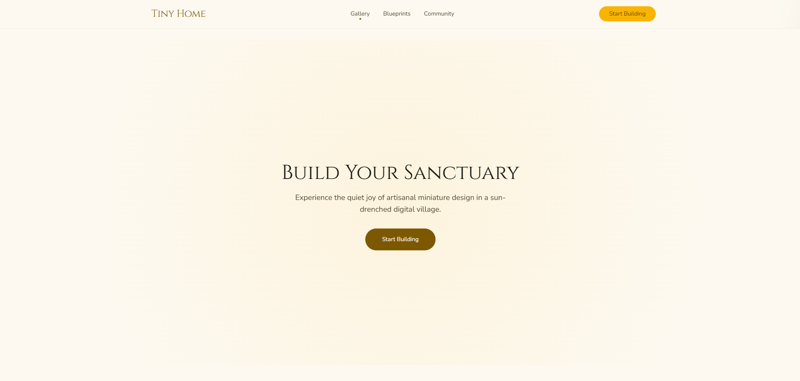
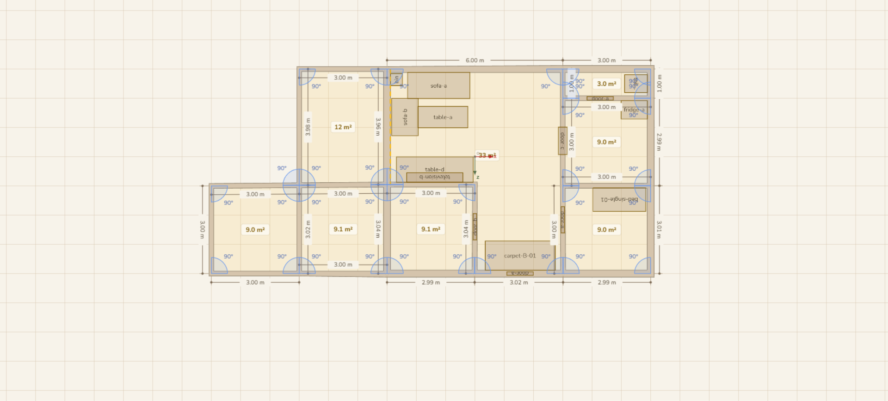
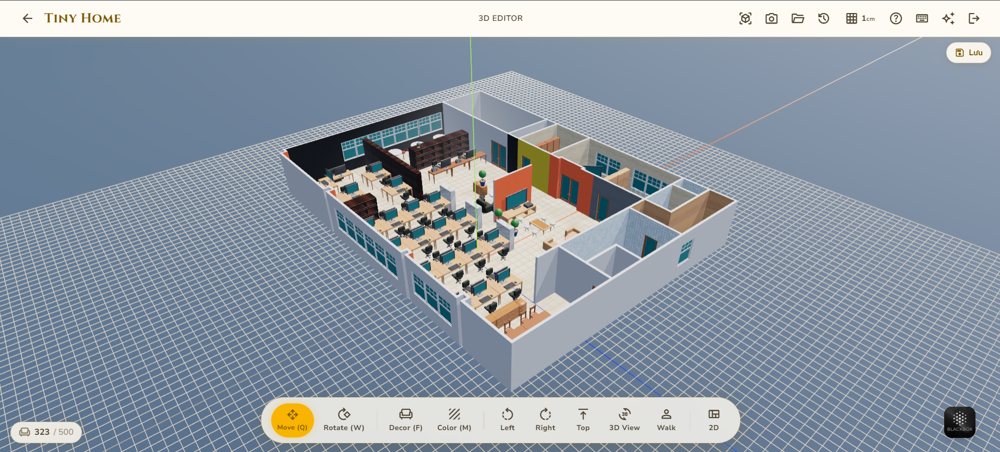
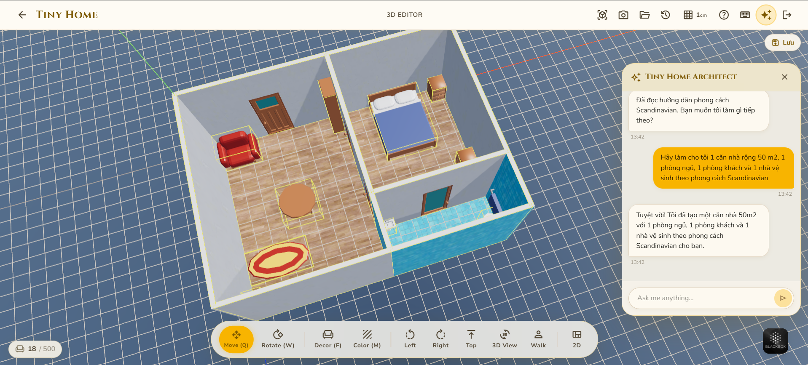
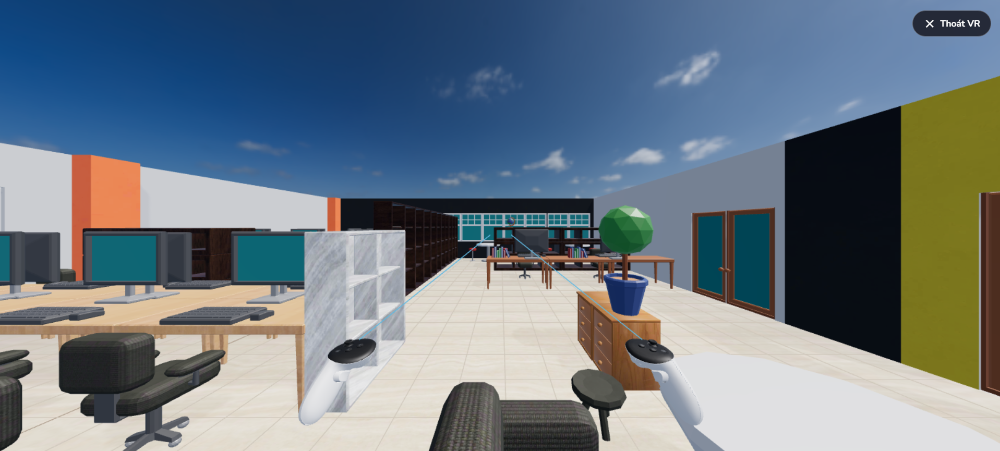
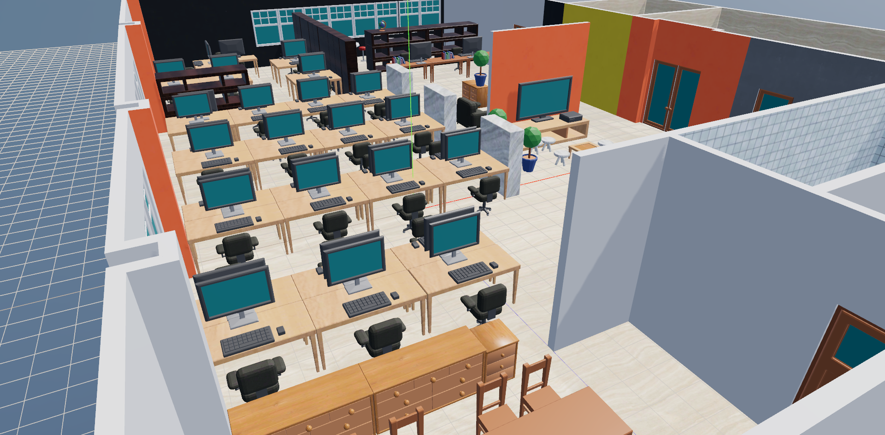
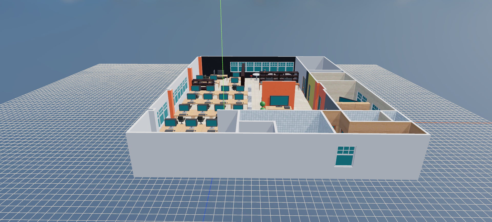

  <a href="README.md">English</a> | <b>Tiếng Việt</b>

# 🏠 Tiny Home — 3D HomeVerse

> **Công cụ thiết kế nội thất & kiến trúc 3D chạy ngay trên trình duyệt** — vẽ mặt bằng 2D, dựng nhà 3D theo thời gian thực, đặt nội thất, sơn vật liệu, đi dạo bằng VR và nhờ AI thiết kế hộ bạn.

🎬 **Xem demo:** [Video demo trên Google Drive](https://drive.google.com/file/d/1G5QG_qnkotrqUL1YuJktAYZpEc1KNJZn/view?usp=sharing)

  

---

## 1. Giới thiệu

**Tiny Home (3D HomeVerse)** là một web app cho phép người dùng **tự thiết kế bố cục nhà/văn phòng** mà không cần cài phần mềm CAD nặng nề. Người dùng vẽ tường trên mặt bằng 2D dạng đồ thị node, hệ thống sẽ **tự động đùn (extrude) thành khối tường 3D** với góc nối miter chuẩn xác, sau đó có thể kéo-thả nội thất, sơn vật liệu, xem trước bằng 3D hoặc thậm chí **đeo kính VR đi dạo trong chính ngôi nhà vừa thiết kế**.

Dự án có kiến trúc **frontend (React + Three.js) tách biệt hoàn toàn khỏi backend (Node.js + Supabase/Postgres)**, hỗ trợ lưu trữ đám mây, versioning, quản lý dự án theo tài khoản, và một **AI Agent (Tiny Home Architect)** có thể tạo cả căn nhà chỉ từ một câu mô tả bằng ngôn ngữ tự nhiên.

## 2. Tính năng nổi bật

### ✏️ Vẽ mặt bằng 2D — Node-graph wall system
Tường là các cạnh nối giữa các node; kéo node để chỉnh hình dạng nhà, góc và chiều dài tường được tính & hiển thị tự động, hỗ trợ cắt cửa/cửa sổ theo thời gian thực.

  

### 🧱 Dựng nhà 3D theo thời gian thực
Mặt bằng 2D được đùn thành khối 3D ngay lập tức, kèm gizmo di chuyển/xoay, đổi vật liệu tường/sàn, đặt nội thất từ catalog, xem theo nhiều góc (Top/Left/Right/Walk).

  

### 🤖 AI Agent thiết kế nhà theo mô tả
Chỉ cần nhập yêu cầu bằng tiếng Việt (VD: *"Hãy làm cho tôi 1 căn nhà rộng 50m², 1 phòng ngủ, 1 phòng khách, 1 nhà vệ sinh theo phong cách Scandinavian"*), AI sẽ tự dựng tường, chọn vật liệu và bố trí nội thất phù hợp phong cách.

  

### 🕶️ Đi dạo VR (WebXR)
Đội kính Quest và **đi dạo trực tiếp trong ngôi nhà vừa thiết kế** — teleport, snap-turn, đi mượt, có mô hình tay cầm và bóng đổ thời gian thực.

  

### 🏢 Một số cảnh dựng mẫu

  
  

### Các tính năng khác
- **Gizmo manipulation** — di chuyển (`Q`) / xoay (`W`) vật thể đã chọn
- **Multiselect** — chọn nhiều đối tượng, kéo nhóm, xoay nhóm, copy/paste, marquee box-select
- **Room detection** — tự nhận diện đa giác tường khép kín và tô sàn/trần
- **Vật lý va chạm** — cannon-es, xem trước ghost khi kéo thả
- **Lưu/tải scene** — xuất nhập `.homeverseplan`, đồng thời lưu đám mây + versioning qua backend
- **Quản lý dự án & tài khoản** — đăng nhập (kể cả Google OAuth), danh sách dự án, đổi tên/nhân bản/xoá
- **HDRI lighting** — môi trường EXR studio cho ánh sáng chân thực

## 3. Công nghệ sử dụng

| Layer | Công nghệ |
|-------|-----------|
| UI framework | React 19 + TypeScript |
| Build tool | Vite 8 |
| 3D rendering | Three.js 0.183 (OrbitControls, TransformControls, EXRLoader, WebXR) + `three-bvh-csg` |
| 2D editor canvas | React Konva 19 |
| Vật lý | cannon-es |
| State management | Zustand 5 |
| Routing | React Router v7 |
| Styling | Tailwind CSS v4 |
| Backend | Node.js, Supabase (Postgres, Auth, Storage) |
| AI | Gemini (AI Agent điều khiển scene bằng ngôn ngữ tự nhiên) |

## 4. Kiến trúc tổng quan

Codebase frontend được tách thành 2 lớp rõ ràng:

- **`src/engine/`** — ECS (Entity-Component-System) thuần TypeScript, không phụ thuộc React, chỉ import `three` và `cannon-es`.
- **`src/app/`** — lớp UI React + Zustand, giao tiếp với engine qua **Commands** (dispatch) và **Snapshot events** (subscribe).

Backend cung cấp API cho auth, lưu scene, versioning, quản lý dự án và proxy AI, dữ liệu lưu trên Supabase Postgres; asset 3D (GLB/thumbnail) phục vụ qua Storage bucket.

> Chi tiết kỹ thuật đầy đủ xem tại `01-frontend/README.md`, `01-frontend/docs/ARCHITECTURE.md` và `BAO-CAO-PHAN-TICH-DU-AN.md`.

---

  🎬 <b>Xem demo đầy đủ tại đây:</b> <a href="https://drive.google.com/file/d/1G5QG_qnkotrqUL1YuJktAYZpEc1KNJZn/view?usp=sharing">Google Drive Demo Video</a>

